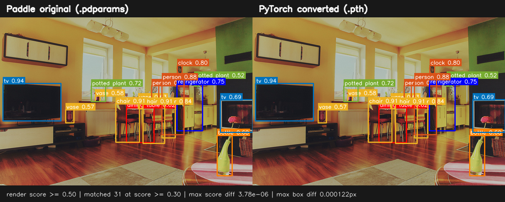
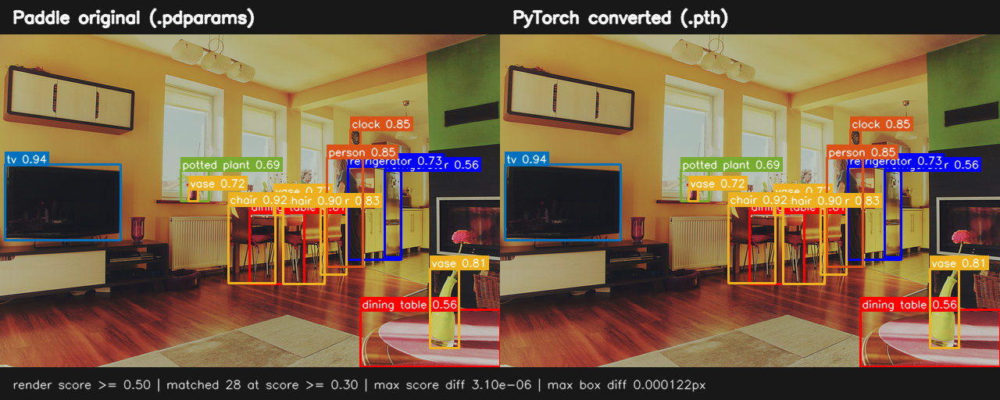

# R18/R34/R50 权重转换可视化对比

> 历史报告快照（2026-07-19，M6）：本文保存 `v0.1.0` 权重对比记录，不代表后续版本状态。当前合同见 [`docs/models/rtdetrv3`](../../../models/rtdetrv3/README.md)。

- 状态：`verified`
- 验证日期：`2026-07-19`
- 范围：官方 Paddle R18/R34/R50 权重与对应 PyTorch 转换权重，同一张 COCO val2017 图片

## 统一渲染结果

### R18


### R34



### R50



三组对比都使用同一张原图和同一个仓库脚本渲染，因此框颜色、文字、阈值和坐标取整规则一致。图中只绘制 `score >= 0.5` 的预测以降低遮挡；数值比较和 JSON 证据保留 `score >= 0.3` 的全部预测。

| 模型 | Paddle / PyTorch 预测数 | 匹配数 | 未匹配数 | 最大 score 绝对差 | 最大框 XYXY L∞ 差 | 机器可读证据 |
|---|---:|---:|---:|---:|---:|---|
| R18 | 30 / 30 | 30 | 0 / 0 | `1.3709068e-6` | `9.1552734e-5 px` | [JSON](data/r18-coco-000000000139-comparison.json) |
| R34 | 31 / 31 | 31 | 0 / 0 | `3.7848949e-6` | `1.2207031e-4 px` | [JSON](data/r34-coco-000000000139-comparison.json) |
| R50 | 28 / 28 | 28 | 0 / 0 | `3.0994415e-6` | `1.2207031e-4 px` | [JSON](data/r50-coco-000000000139-comparison.json) |

这是对该图片的已验证观测，证明三份转换权重在一个真实预处理/后处理路径上没有出现可见偏差；它不单独代表整个数据集的 AP 或训练收敛。只有 R18 已完成同权重完整 val2017 数值门禁，见[COCO 精度验证报告](accuracy-validation.md)。

## 协议和输入

| 项目 | 值 |
|---|---|
| 模型 | RT-DETRv3-R18/R34/R50，`640 x 640` TestReader |
| 运行条件 | CPU / FP32 / eval，各框架单独运行；`OMP_NUM_THREADS=1`、`MKL_NUM_THREADS=1` |
| Python / Paddle / PyTorch | `3.12.11` / `3.3.0` / `2.5.1+cu121` |
| OpenCV | `4.5.5` |
| COCO 图片 | `val2017/000000000139.jpg`，SHA-256 `ffe0f0cec3b2e27aab1967229cdf0a0d7751dcdd5800322f0b8ac0dffb3b8a8d` |
| COCO annotation | `instances_val2017.json`，SHA-256 `e8c7f7908f1d7278341fae127d0da654f102f11bd7b21d8aeefa635b8c810b6f` |
| 匹配规则 | `score >= 0.3`；同类别候选中最小化 XYXY 坐标 L∞ 差，要求 `<= 1 px` |

| 模型 | Paddle checkpoint 大小 / SHA-256 | PyTorch checkpoint 大小 / SHA-256 |
|---|---|---|
| R18 | `91,945,530` / `f32dbd008bd7e5311c877d522f6d8c9e349795978c889f53823588b5e5d74a5f` | `92,075,629` / `cb89c589c0a37fbe060554bc26bd662885702c72e3ef0890a54338e9746d0547` |
| R34 | `137,016,081` / `29b09c64d6c372cde46d94caee1b57a23cee0aae24bd7bd3e2937cf57e581a68` | `137,170,947` / `e69207749b37e493596086579f435d5f08e9f058b66322452456053b78a4f272` |
| R50 | `182,331,170` / `e8b1d5db3208ce0f9edba5a914f23c918141b608ab4cd409db9d9204f7ed4b08` | `182,510,207` / `5e3e34ac3d3d14f57ebf6100b146b5702f8dface24fbe57cbc993f59381b67f7` |

## 复现

以下示例选择 R34；将 `MODEL`、`MODEL_NAME`、`CONFIG` 和 `CHECKPOINT` 一起替换即可复现 R18/R50。以仓库根目录为起点，先产生两份原始 COCO JSON：

```bash
COCO_ROOT=/path/to/coco2017
MODEL=r34
MODEL_NAME=RT-DETRv3-R34
CONFIG=rtdetrv3_r34vd_6x_coco.yml
CHECKPOINT=rtdetrv3_r34vd_6x_coco

OMP_NUM_THREADS=1 MKL_NUM_THREADS=1 CUDA_VISIBLE_DEVICES="" \
  .venv/bin/python -m ppdet_pytorch.cli.infer \
  -c "configs/rtdetrv3/$CONFIG" \
  --checkpoint "pretrained_models/pytorch/$CHECKPOINT.pth" \
  --infer-img "$COCO_ROOT/val2017/000000000139.jpg" \
  --anno-file "$COCO_ROOT/annotations/instances_val2017.json" \
  --device cpu --threshold 0.3 --save-results \
  --output-dir "output/visual-comparison/$MODEL/pytorch"

(
  cd third-party/RT-DETRv3-paddle
  OMP_NUM_THREADS=1 MKL_NUM_THREADS=1 CUDA_VISIBLE_DEVICES="" \
    ../../.venv/bin/python tools/infer.py \
    -c "configs/rtdetrv3/$CONFIG" \
    --infer_img "$COCO_ROOT/val2017/000000000139.jpg" \
    --output_dir "../../output/visual-comparison/$MODEL/paddle" \
    --draw_threshold 0.3 --save_threshold 0.3 \
    --save_results True --visualize False \
    -o use_gpu=False \
    weights="../../pretrained_models/paddle/$CHECKPOINT.pdparams" \
    TestDataset.dataset_dir="$COCO_ROOT" \
    TestDataset.anno_path=annotations/instances_val2017.json
)
```

再用同一渲染器比较：

```bash
.venv/bin/python scripts/render_prediction_comparison.py \
  --model "$MODEL_NAME" \
  --image "$COCO_ROOT/val2017/000000000139.jpg" \
  --annotations "$COCO_ROOT/annotations/instances_val2017.json" \
  --paddle-results "output/visual-comparison/$MODEL/paddle/bbox.json" \
  --pytorch-results "output/visual-comparison/$MODEL/pytorch/detections.json" \
  --paddle-checkpoint "pretrained_models/paddle/$CHECKPOINT.pdparams" \
  --pytorch-checkpoint "pretrained_models/pytorch/$CHECKPOINT.pth" \
  --output-image "docs/archive/rtdetrv3-v0.1.0/reports/assets/$MODEL-coco-000000000139-comparison.png" \
  --output-json "docs/archive/rtdetrv3-v0.1.0/reports/data/$MODEL-coco-000000000139-comparison.json"
```

`--model` 必须与当前权重一致，避免图像正确但 JSON 元数据仍沿用默认 R18 名称。JSON 不记录工作站绝对路径，但记录图片、annotation、两个 checkpoint 的大小与 SHA-256，以及统一后的预测和逐项匹配误差。
