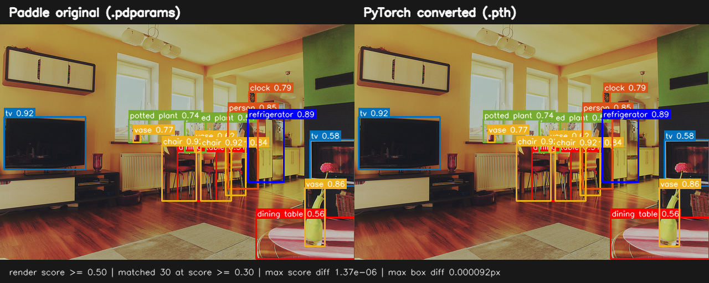

# R18 权重转换可视化对比

- 状态：`verified`
- 验证日期：`2026-07-19`
- 范围：官方 Paddle R18 权重与转换后 PyTorch R18 权重，单张 COCO val2017 图片



两侧使用同一张原图和同一个仓库脚本渲染，因此框颜色、文字、阈值和坐标取整规则一致。图中只绘制 `score >= 0.5` 的预测以降低遮挡；数值比较和[JSON 证据](data/r18-coco-000000000139-comparison.json)保留 `score >= 0.3` 的全部预测。

## 协议和输入

| 项目 | 值 |
|---|---|
| 模型 | RT-DETRv3-R18，`640 x 640` TestReader |
| 运行条件 | CPU / FP32 / eval，各框架单独运行 |
| Python / Paddle / PyTorch | `3.12.11` / `3.3.0` / `2.5.1+cu121` |
| OpenCV | `4.5.5` |
| COCO 图片 | `val2017/000000000139.jpg`，SHA-256 `ffe0f0cec3b2e27aab1967229cdf0a0d7751dcdd5800322f0b8ac0dffb3b8a8d` |
| COCO annotation | `instances_val2017.json`，SHA-256 `e8c7f7908f1d7278341fae127d0da654f102f11bd7b21d8aeefa635b8c810b6f` |
| Paddle checkpoint | `91,945,530` 字节，SHA-256 `f32dbd008bd7e5311c877d522f6d8c9e349795978c889f53823588b5e5d74a5f` |
| PyTorch checkpoint | `92,075,629` 字节，SHA-256 `cb89c589c0a37fbe060554bc26bd662885702c72e3ef0890a54338e9746d0547` |
| 匹配规则 | `score >= 0.3`；同类别候选中最小化 XYXY 坐标 L∞ 差，要求 `<= 1 px` |

两侧都输出 `30` 个预测，`30/30` 匹配，无未匹配项。匹配项的 score 最大绝对差为 `1.3709068298339844e-6`，框 XYXY 坐标最大 L∞ 差为 `9.1552734375e-5 px`。这是对该图片的已验证观测；不单独代表整个数据集的 AP 或训练收敛。完整 val2017 证据见[COCO 精度验证报告](accuracy-validation.md)。

## 复现

以仓库根目录为起点，先产生两份原始 COCO JSON：

```bash
COCO_ROOT=/path/to/coco2017

CUDA_VISIBLE_DEVICES="" .venv/bin/python -m ppdet_pytorch.cli.infer \
  -c configs/rtdetrv3/rtdetrv3_r18vd_6x_coco.yml \
  --checkpoint pretrained_models/pytorch/rtdetrv3_r18vd_6x_coco.pth \
  --infer-img "$COCO_ROOT/val2017/000000000139.jpg" \
  --anno-file "$COCO_ROOT/annotations/instances_val2017.json" \
  --device cpu --threshold 0.3 --save-results \
  --output-dir output/visual-comparison/pytorch

(
  cd third-party/RT-DETRv3-paddle
  CUDA_VISIBLE_DEVICES="" ../../.venv/bin/python tools/infer.py \
    -c configs/rtdetrv3/rtdetrv3_r18vd_6x_coco.yml \
    --infer_img "$COCO_ROOT/val2017/000000000139.jpg" \
    --output_dir ../../output/visual-comparison/paddle \
    --draw_threshold 0.3 --save_threshold 0.3 \
    --save_results True --visualize False \
    -o use_gpu=False \
    weights=../../pretrained_models/paddle/rtdetrv3_r18vd_6x_coco.pdparams \
    TestDataset.dataset_dir="$COCO_ROOT" \
    TestDataset.anno_path=annotations/instances_val2017.json
)
```

再用同一渲染器比较：

```bash
.venv/bin/python scripts/render_prediction_comparison.py \
  --image "$COCO_ROOT/val2017/000000000139.jpg" \
  --annotations "$COCO_ROOT/annotations/instances_val2017.json" \
  --paddle-results output/visual-comparison/paddle/bbox.json \
  --pytorch-results output/visual-comparison/pytorch/detections.json \
  --paddle-checkpoint pretrained_models/paddle/rtdetrv3_r18vd_6x_coco.pdparams \
  --pytorch-checkpoint pretrained_models/pytorch/rtdetrv3_r18vd_6x_coco.pth \
  --output-image docs/reports/assets/r18-coco-000000000139-comparison.png \
  --output-json docs/reports/data/r18-coco-000000000139-comparison.json
```

JSON 不记录工作站绝对路径，但记录图片、annotation、两个 checkpoint 的大小与 SHA-256，以及统一后的预测和逐项匹配误差。
